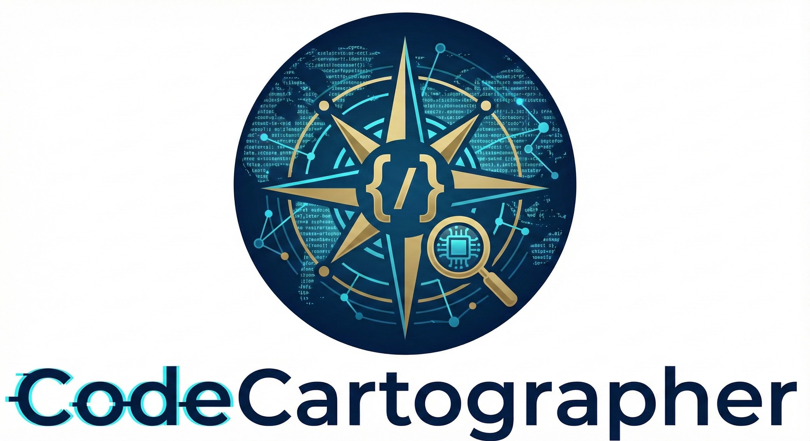

# CodeCartographer

<p align="center">
  
</p>

**Swift Static Analyzer for AI Coding Assistants**

CodeCartographer is an MCP server that gives AI assistants deep understanding of Swift codebases. It provides 35 analysis tools for code quality, refactoring, and migration planning.

## Quick Start

```bash
# Build
git clone https://github.com/bmdragos/CodeCartographer-Swift.git
cd CodeCartographer-Swift
swift build

# Install (optional)
sudo ln -sf "$(pwd)/.build/debug/codecart" /usr/local/bin/codecart
```

## MCP Integration (Recommended)

CodeCartographer runs as an [MCP server](https://modelcontextprotocol.io/), enabling AI assistants to directly analyze your Swift code.

### Windsurf / Cursor

Add to `~/.codeium/windsurf/mcp_config.json`:

```json
{
  "mcpServers": {
    "codecartographer": {
      "command": "/usr/local/bin/codecart",
      "args": ["serve"]
    }
  }
}
```

### Claude Desktop

Add to `~/Library/Application Support/Claude/claude_desktop_config.json`:

```json
{
  "mcpServers": {
    "codecartographer": {
      "command": "codecart",
      "args": ["serve", "/path/to/swift/project"]
    }
  }
}
```

### Dynamic Project Switching

The server can start without a project path. Use the `set_project` tool to switch between codebases:

```
AI: "Switch to the iOS project"
→ set_project("/path/to/iOS")
→ {"status": "switched", "fileCount": 1099}
```

## Available Tools (35)

### Core Analysis
| Tool | Description |
|------|-------------|
| `get_summary` | Project health overview with top issues |
| `analyze_file` | Deep health check for a single file |
| `set_project` | Switch to a different Swift project |

### Code Quality
| Tool | Description |
|------|-------------|
| `find_smells` | Force unwraps, magic numbers, deep nesting |
| `find_god_functions` | Large/complex functions needing refactoring |
| `find_retain_cycles` | Memory leak risk detection |
| `find_unused_code` | Dead code detection |
| `find_tech_debt` | TODO/FIXME/HACK markers |

### Refactoring
| Tool | Description |
|------|-------------|
| `suggest_refactoring` | Extraction opportunities for god functions |
| `get_refactor_detail` | Copy-paste ready extracted function |
| `check_impact` | Blast radius before modifying a symbol |

### Architecture
| Tool | Description |
|------|-------------|
| `find_types` | Types, protocols, inheritance hierarchy |
| `find_delegates` | Delegate wiring patterns |
| `find_singletons` | Global state usage (.shared, .default) |
| `analyze_api_surface` | Public API signatures |

### Framework-Specific
| Tool | Description |
|------|-------------|
| `analyze_swiftui` | SwiftUI patterns and @State management |
| `analyze_uikit` | UIKit patterns and modernization score |
| `find_viewcontrollers` | ViewController lifecycle audit |
| `analyze_coredata` | Core Data entities and fetch requests |
| `find_reactive` | RxSwift/Combine subscriptions |

### Migration & Dependencies
| Tool | Description |
|------|-------------|
| `track_property` | Find all accesses to a property pattern |
| `find_calls` | Find method call patterns |
| `analyze_auth_migration` | Auth code tracking for migration |
| `generate_migration_checklist` | Phased migration plan |
| `analyze_dependencies` | CocoaPods/SPM/Carthage analysis |

### Quality Audits
| Tool | Description |
|------|-------------|
| `find_localization_issues` | Hardcoded strings and i18n coverage |
| `find_accessibility_issues` | Accessibility API coverage |
| `find_threading_issues` | Thread safety and concurrency |
| `analyze_docs` | Documentation coverage |
| `analyze_tests` | Test coverage with target awareness |
| `find_network_calls` | API endpoints and network patterns |

### Utilities
| Tool | Description |
|------|-------------|
| `list_files` | List Swift files in project |
| `read_source` | Read file contents with line range |
| `invalidate_cache` | Clear cached analysis results |
| `rescan_project` | Rescan for new/deleted files |

## Performance

The MCP server is optimized for AI agent workflows:

- **Instant startup** - Background initialization, responds to MCP immediately
- **AST caching** - Files parsed once, reused across tools
- **Result caching** - 29 tools cache results for instant repeated queries
- **File watching** - Auto-invalidates cache when files change
- **Smart warmup** - Pre-parses large projects (50+ files) in background

| Project Size | First Query | Cached Query |
|--------------|-------------|--------------|
| 30 files | ~0.5s | instant |
| 300 files | ~2s | instant |
| 1000+ files | ~5s | instant |

## CLI Usage

CodeCartographer also works as a standalone CLI:

```bash
# Quick summary
codecart /path/to/project --summary

# Code smells
codecart /path/to/project --smells --verbose

# All 30 analysis modes
codecart --list

# Save to file
codecart /path/to/project --functions --output report.json
```

### Available CLI Modes

| Mode | Flag | Description |
|------|------|-------------|
| Summary | `--summary` | AI-friendly health overview |
| Health | `--health FILE` | Single file health report |
| Smells | `--smells` | Code smell detection |
| Functions | `--functions` | Function metrics |
| Refactor | `--refactor` | God function extraction suggestions |
| Types | `--types` | Type hierarchy analysis |
| Singletons | `--singletons` | Global state patterns |
| Tests | `--tests` | Test coverage analysis |
| All | `--all` | Run all analyses |

Run `codecart --list` for all 30 modes.

## Example AI Workflow

```
User: "Help me refactor the main.swift file"

AI uses CodeCartographer:
1. get_summary → 49 god functions, 171 smells
2. analyze_file("main.swift") → health score 35, 1 god function
3. suggest_refactoring("main.swift") → 7 extraction opportunities
4. check_impact("main") → affects 12 files
5. get_refactor_detail("main.swift", 100, 200) → ready-to-use extracted function

AI: "I found the main() function has 797 lines. Here's an extraction..."
```

## Requirements

- Swift 5.9+
- macOS 13+

## Contributing

Contributions welcome! Ideas:
- Additional analyzers
- IDE integrations
- Visualization tools

## License

MIT License - see [LICENSE](LICENSE)

## Acknowledgments

Built with [SwiftSyntax](https://github.com/apple/swift-syntax) for accurate AST-based analysis.
